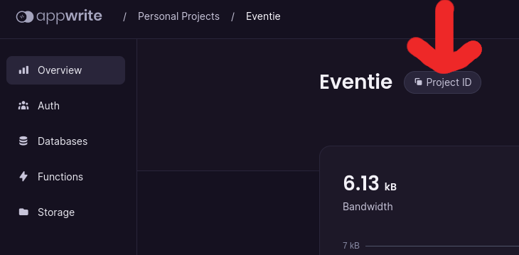

# Eventie
## Description
This web application is designed to help event organizers manage event registration and attendance tracking in a more efficient and organized way. With this application, event organizers can create events, register users to events, and mark users as participated using QR codes.

### Features
- Event Creation: With this application, event organizers can easily create and set up events by providing event details such as event name, description, date, and time.

- User Registration: Event organizers can allow users to register for events by providing basic information such as name, email address, and phone number.

- Attendance Tracking: The application allows event organizers to track attendance by scanning the QR code of the registered users. This helps to ensure that only registered users are allowed to attend the event and also helps to keep track of attendance during the event.

## Project structure
### Tech stack
- Appwrite
- Vue.js
- TailwindCSS
- Express.js
- Node.js

### Folder structure
<details>
<summary>Click to expand</summary>

<pre>
.
├── backend                         Backend application using Appwrite and Node.js with Express
│   ├── appwriteSetup.js            Appwrite initialization; Use this to use new features
│   ├── functions                   Appwrite functions
│   │   ├── appwrite.json           Appwrite functions configuration; Autogenerated using cli
│   │   └── functions
│   │       ├── SetImageUrl         Listener on document.create which updates the image url field
│   ├── images                      Images for readme
│   └── routes                      Route handlers for /api route
│       ├── events                  Route handlers for /api/events route
│       └── users                   Route handlers for /api/users route
├── public                          Static files for the frontend
│   └── images
└── src                             Source files for the frontend
    ├── assets
    ├── components                  Vue coponents
    ├── router                      Vue router
    ├── stores                      Vue stores
    └── views                       Vue views
</pre>
</details>
## Setup
#### Recommended IDE Setup

[VSCode](https://code.visualstudio.com/) + [Volar](https://marketplace.visualstudio.com/items?itemName=Vue.volar) (and disable Vetur) + [TypeScript Vue Plugin (Volar)](https://marketplace.visualstudio.com/items?itemName=Vue.vscode-typescript-vue-plugin).

1. Install appwrite according to [official guide](https://appwrite.io/docs/installation). If you use a custom port or hostname for appwrite, make sure to replace `localhost` with `[HOST]:[PORT]` in following instructions.
2. Visit `http://localhost` and follow the instructions. Create a new project and a new user.
3. Create a new file called `.config.js` in `/PROJECT_ROOT/backend/.config.json`  with following attributes:

```js
const config = {
    PORT: 3456, // port to run backend application
    ENDPOINT: 'http://localhost/v1', // appwrite endpoint
    PROJECT: 'project id', // project id
    API_KEY: 'api key', // your api key from appwrite console
};

export default config;
```

Project id can be found in Project Overview page in Appwrite console.



See [Appwrite API Key](https://appwrite.io/docs/keys) to generate an API key.


#### Customize configuration

See [Vite Configuration Reference](https://vitejs.dev/config/).

#### Project Setup

```sh
npm install;
cd backend;
npm install;
```

#### Compile and Hot-Reload for Development
In terminal 1
```sh
npm run dev
```
In terminal 2
```sh
cd backend;
npm run dev
```

### Compile and Minify for Production

```sh
npm run build
```
